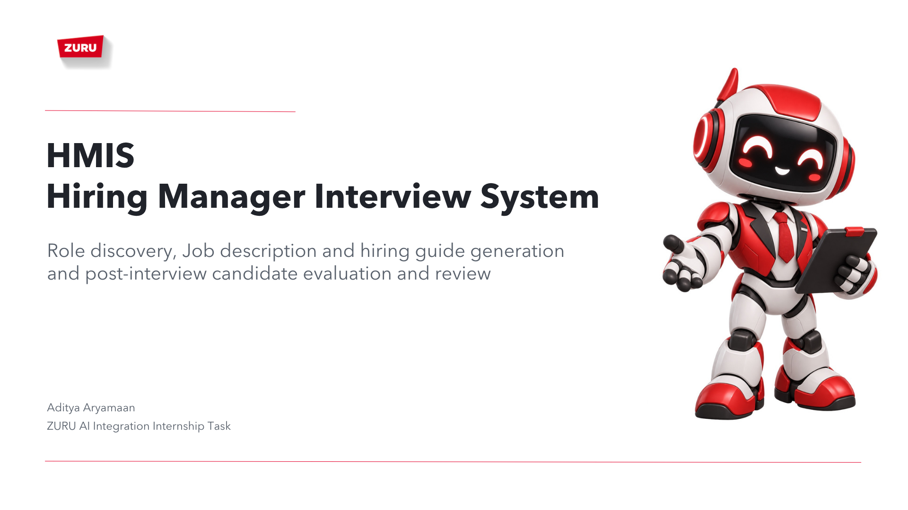

# HMIS ZURU

Low-code proof of concept for the ZURU AI Integration Internship take home assignment.



HMIS contains two connected n8n workflows:

1. **Hiring Manager Interview** asks adaptive questions, confirms a structured role brief, and generates a ZURU-style job description, hiring guide, machine-readable rubric, and Hiring Brief Readiness result.
2. **Candidate Evaluation Assistant** reviews post-interview evidence against the approved rubric, reports criterion scores and evidence confidence, and highlights areas for human review.

The evaluator runs after an interview. It accepts pasted answers, structured notes, or speaker-labelled TXT/VTT transcripts. It does not make the final hiring decision.

## Demonstrated scope

The POC uses:

- Telegram as the hiring-manager interface;
- local n8n orchestration in Docker;
- OpenRouter as the model gateway;
- Gotenberg for local PDF conversion;
- an n8n form for candidate evidence submission;
- synthetic candidate information.

Google Docs, WhatsApp, automatic Microsoft Teams retrieval, ATS integration, persistent multi-user state, and a permanent public domain are future integration options. See [Assignment scope](docs/assignment-scope.md) and the [system architecture](system_design/system_architecture.pdf).

## Generated outputs

Workflow 1 returns:

- `job-description.pdf` — the manager-facing job description;
- `hiring-guide.pdf` — screening questions, assessment anchors, green flags, concerns, and human checkpoints;
- `role-rubric.json` — the machine-readable contract passed to Workflow 2;
- a deterministic Hiring Brief Readiness score and clarification areas.

Workflow 2 returns `candidate-evidence-review.pdf`, containing criterion-level evidence, scores, confidence labels, and reviewer actions. The human panel owns the progression decision.

## Repository structure

```text
n8n/           Docker Compose environment and safe environment template
workflows/     The two demonstrated n8n workflow exports
prompts/       Versioned AI prompts used by the exports
tests/         Automated workflow and deterministic-logic tests
docs/          Scope, ingestion, style, and node-level documentation
examples/      Supplied job-description style references
resources/     Branding and architecture reference assets
system_design/ Final system architecture PDF
```

The local `testing/` directory contains disposable demo inputs and generated outputs. It is intentionally ignored by Git.

## Prerequisites

Install:

- Git;
- Docker Desktop with Docker Compose;
- Python 3, used once to generate local secrets;
- Node.js, only if you want to run the automated tests.

You also need an OpenRouter API key and a Telegram account.

## Fresh installation

### 1. Clone and enter the repository

```bash
git clone https://github.com/aditya-aryamaan/HMIS_ZURU.git
cd HMIS_ZURU
```

If you already have the repository, run the remaining commands from its root directory.

### 2. Create the local environment file

**Existing installation:** If `n8n/.env` already exists because you installed n8n with `get-n8n.sh`, skip this entire step. The installer generated these values for you. Do not run the copy command because it would overwrite your working local configuration.

**Fresh clone only:** The real `.env` is intentionally excluded from Git because it contains secrets. Create it from the safe template:

Copy the committed template:

```bash
cp n8n/.env.example n8n/.env
```

Generate four independent local secrets and replace the matching placeholders:

```bash
python3 - <<'PY'
from pathlib import Path
import secrets

path = Path("n8n/.env")
text = path.read_text()
for placeholder in (
    "CHANGE_ME_RUNNERS_AUTH_TOKEN",
    "CHANGE_ME_SANDBOX_SERVICE_KEY",
    "CHANGE_ME_RUNNER_REGISTRATION_TOKEN",
    "CHANGE_ME_RUNNER_API_KEY",
):
    text = text.replace(placeholder, secrets.token_hex(32))
path.write_text(text)
PY
```

These four random values authenticate communication between n8n's internal task-runner and sandbox containers. They are not the OpenRouter API key or Telegram bot token. Keep `n8n/.env` local; it is ignored by Git and must never be committed.

### 3. Start n8n and the PDF service

Start Docker Desktop, then run:

```bash
docker compose -f n8n/compose.yml up -d
docker compose -f n8n/compose.yml ps
```

Wait until the services are healthy, then open [http://localhost:5678](http://localhost:5678). On a new installation, create the local n8n owner account.

Gotenberg runs only inside the Docker network at `http://gotenberg:3000`; it has no separate account or public port.

### 4. Start the temporary Telegram tunnel

Telegram requires a public HTTPS webhook. Start the optional Cloudflare Quick Tunnel:

```bash
docker compose -f n8n/compose.yml --profile telegram up -d
docker compose -f n8n/compose.yml logs -f cloudflared
```

Copy the generated `https://...trycloudflare.com` address. Press `Ctrl+C` to leave the log view; the container continues running.

Set that address as `WEBHOOK_URL` in `n8n/.env`, including `https://`, then recreate n8n:

```bash
docker compose -f n8n/compose.yml up -d --force-recreate n8n
```

Continue using the editor at [http://localhost:5678](http://localhost:5678). The tunnel exists only for incoming Telegram and form requests. Its address changes whenever the tunnel container is recreated, so repeat this step when the old URL expires.

### 5. Import both workflows

In n8n, import these files as separate workflows:

- `workflows/01-hiring-pack-generator.json`
- `workflows/02-candidate-evaluator.json`

The exports are intentionally inactive and contain no usable credentials.

### 6. Configure the OpenRouter credential

Create an **OpenRouter API** credential in n8n using your API key. Open the **OpenRouter Chat Model** node in each workflow and select that credential.

The current exports use `google/gemini-3.6-flash`. If you change the model, test structured JSON generation and both validation paths before the demonstration.

### 7. Create a Telegram bot

Each installation should use its own bot. Reusing somebody else's bot would require sharing their secret token, and Telegram allows only one active webhook per bot, so the installations would interrupt each other.

1. In Telegram, open the verified **@BotFather** account.
2. Send `/newbot`.
3. Enter a display name, such as `HMIS ZURU Demo`.
4. Enter a unique username ending in `bot`, such as `your_name_hmis_bot`.
5. Copy the bot token returned by BotFather and store it securely. Do not paste it into workflow code, documentation, screenshots, or Git.
6. Optionally send `/setcommands`, select the new bot, and register:

   ```text
   start - Open the HMIS menu
   menu - Open the HMIS menu
   help - Show the available options
   ```

The bot does not need to be added to a group. Open its direct chat and press **Start** after Workflow 1 has been published.

For the take-home presentation, the project owner can use the already configured private demo bot. Anyone cloning the repository should create their own bot and credential.

### 8. Configure the Telegram credential

Create a **Telegram API** credential using the BotFather token. In Workflow 1, select it on:

- **Telegram message received**;
- every Telegram send node;
- **Acknowledge Telegram button**.

n8n marks any node that is still missing a credential.

### 9. Publish the candidate evaluator

Open Workflow 2 and publish it. Open **Candidate review form**, copy its **Production URL**, and test that the form opens through the current tunnel address.

### 10. Configure Workflow 1 routing

Open **Authorize and route Telegram message** in Workflow 1 and replace:

```javascript
const ALLOWED_USER_IDS=['REPLACE_WITH_APPROVED_TELEGRAM_USER_ID'];
const CANDIDATE_FORM_URL='REPLACE_WITH_WORKFLOW_02_PRODUCTION_FORM_URL';
```

Use the Workflow 2 Production URL for `CANDIDATE_FORM_URL`.

If you do not know your Telegram numeric user ID, publish Workflow 1 with the placeholder, send `/start` to the bot, and inspect the latest n8n execution. The output of **Authorize and route Telegram message** contains `manager_id`; copy that value into `ALLOWED_USER_IDS`, save, and publish again.

### 11. Run a smoke test

Send `/start` to the bot. Confirm that both inline menu buttons appear and that **Candidate Evaluation** opens the Workflow 2 form.

Use synthetic role and candidate information during testing and the presentation.

## Demonstration sequence

### Workflow 1 — hiring pack

1. Send `/start` and select **Job Description & Hiring Rubric**.
2. Enter a short synthetic role brief.
3. Answer the adaptive follow-up questions.
4. Request `REVIEW BRIEF` and correct inaccurate assumptions.
5. Tap **Confirm and generate documents**. The typed `CONFIRM BRIEF AND GENERATE` command remains available as a fallback.
6. Inspect `job-description.pdf`, `hiring-guide.pdf`, and `role-rubric.json`.
7. Show the Hiring Brief Readiness result and explain that TA approval remains mandatory regardless of the score.

### Workflow 2 — candidate evidence review

1. Select **Candidate Evaluation** and open the returned form.
2. Enter a synthetic candidate name and reviewer name.
3. Upload the `role-rubric.json` produced by Workflow 1.
4. Select **I reviewed and approve this rubric**.
5. Choose the evidence source and paste answers or upload a speaker-labelled `.txt`/`.vtt` transcript.
6. For a transcript, enter the candidate name exactly as it appears in the speaker label. The workflow extracts only candidate-labelled turns.
7. Submit the form and inspect `candidate-evidence-review.pdf`.
8. Show the exact evidence, rubric anchor, confidence basis, and any reviewer action. Explain that the report omits a hire/reject verdict.

## Start, restart, and stop

Start the base services:

```bash
docker compose -f n8n/compose.yml up -d
```

Start the base services and Telegram tunnel:

```bash
docker compose -f n8n/compose.yml --profile telegram up -d
```

Restart after editing `n8n/.env`:

```bash
docker compose -f n8n/compose.yml up -d --force-recreate n8n
```

View recent logs:

```bash
docker compose -f n8n/compose.yml logs --tail 100
```

Stop safely:

```bash
docker compose -f n8n/compose.yml --profile telegram down --remove-orphans
```

This removes current containers and containers left by an older Compose configuration while preserving n8n data in Docker volumes. Do not add `-v` during normal shutdown because it deletes those volumes.

## Validation

Run the structural and deterministic safety checks from the repository root:

```bash
node --test tests/workflow-validation.test.mjs tests/hiring-readiness.test.mjs
```

The suite validates workflow structure, nine-area coverage, employment rules, readiness calculation, document rendering, rubric approval, speaker extraction, evidence quotes, confidence ceilings, and PDF handling. It does not replace a live Telegram, OpenRouter, n8n, and PDF-generation smoke test.

## Troubleshooting

### Telegram reports `can't parse entities`

Confirm that **Send Telegram reply → Additional Fields → Parse Mode** is set to **HTML** and that **Prepare Telegram reply** comes from the latest workflow export.

### Telegram says the bot already has a webhook

Only one active Telegram trigger can own a bot webhook. Disable or delete any older workflow using the same bot, then republish Workflow 1.

### The bot stops responding after a restart

Check the `cloudflared` logs. If the Quick Tunnel address changed, update `WEBHOOK_URL`, recreate n8n, and republish Workflow 1 so Telegram receives the new webhook address.

### Docker reports `Network n8n_default Resource is still in use`

Remove services left by an older Compose file:

```bash
docker compose -f n8n/compose.yml --profile telegram down --remove-orphans
```

Use `docker ps -a` if a separately created container still uses the network.

### A validation node rejects AI output

Inspect the validation error and model response. Correct the prompt, model setting, or returned structure. Do not bypass validation to force the execution through.

### PDFs are not generated

Confirm that `gotenberg` is running:

```bash
docker compose -f n8n/compose.yml ps
docker compose -f n8n/compose.yml logs --tail 100 gotenberg
```

The workflow must call `http://gotenberg:3000` from inside the Compose network.

## Secrets and limitations

Store OpenRouter and Telegram credentials in n8n's credential manager. Never commit API keys, bot tokens, OAuth secrets, `n8n/.env`, or exported credential values.

Current POC limitations include temporary conversation memory, a changing Quick Tunnel URL, manual JSON transfer between workflows, no DOCX or audio parsing, and no production identity, audit, retention, ATS, or durable multi-user state. OpenRouter processes AI requests; running n8n locally does not mean the language model runs locally.
